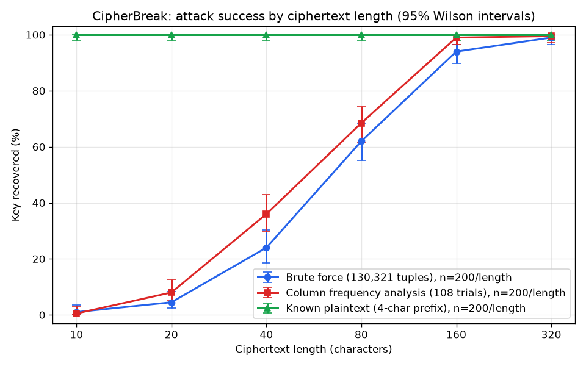

# CipherBreak

[](https://github.com/seedyjahateh/CipherBreak/actions/workflows/ci.yml)

CipherBreak rebuilds a 2024 script of mine, a classical polyalphabetic shift cipher, as a tested
Python package, then **breaks it three ways** (brute force, per-column frequency analysis and
known plaintext), **measures** how fast each attack falls across 1,200 random trials, and shows
**what to use instead** (AES-256-GCM authenticated encryption).

It is a Vigenère-family shift cipher. It is **not** a model of the WWII Enigma machine: there are no
rotors, reflector or plugboard, despite the original script's name
([Enigma-Encryption_-_Decryption](https://github.com/seedyjahateh/Enigma-Encryption_-_Decryption)).
Nothing here is secure, and nothing here is meant to protect real data.

## How the cipher works

The alphabet has 27 symbols: `a`–`z`, then space (index 26). A key is 5 digits, and the date
supplies 4 more:

1. Write the date as `DDMMYY`, square it, and keep the last 4 digits: those are the **offsets**.
2. Add each of the first 4 key digits to its offset: those are the 4 **shifts** (each 0–18).
3. Shift character *j* of the message forward by `shifts[j % 4]`, modulo 27.

Worked example, key `12345` on 2026-10-06:

```
DDMMYY = 061026        061026² = 3,724,172,676        offsets = 2 6 7 6
key digits 1 2 3 4 (+5, never used)                    shifts  = 3 8 10 10

plaintext   h  e  l  l  o  ␣  w  o  r  l  d
shift       3  8 10 10  3  8 10 10  3  8 10
ciphertext  k  m  v  v  r  h  f  y  u  t  n
```

```console
$ cipherbreak encrypt --key 12345 --date 2026-10-06 "hello world"
kmvvrhfyutn
```

Behaviour the original left implicit is pinned down and tested ([docs/DECISIONS.md](docs/DECISIONS.md)):
the 5th key digit is ignored, exactly as in the original; characters outside the alphabet pass
through unchanged but still advance the position; and uppercase is folded to lowercase with a
warning. (I first preserved case, but the round-trip property test showed it cannot work: an
uppercase letter can shift onto space, which has no case.)

## How I broke it

**The key insight: the period is 4, so the ciphertext is just four interleaved Caesar ciphers.**
Characters 0, 4, 8, … all use shift 0; characters 1, 5, 9, … all use shift 1; and so on.

1. **Brute force (ciphertext only).** Try all 19⁴ = **130,321** shift tuples, score each
   decryption with a chi-squared test against English letter-and-space frequencies, and keep the
   best. Decrypting and counting is the same as rotating each column's symbol counts and adding
   them up, so all 130,321 candidates are scored with NumPy in a fraction of a second (a test checks
   the two methods agree).
2. **Column frequency analysis (ciphertext only).** Split the ciphertext into its 4 columns and
   break each one as a Caesar cipher: 27 shifts × 4 columns = **108 trials** instead of 130,321.
   In the experiment it was also at least as accurate as brute force at every length except the
   shortest, where both almost always fail: scoring each column on its own catches a single wrong
   shift that the pooled whole-text score can hide.
3. **Known plaintext.** If you know any 4 characters of the message (`"dear"`, `"hello"`, a header),
   each shift is just `(cipher − plain) mod 27`. No search at all. If you also know the date, the
   offsets are public and only the 10⁴ key-digit combinations remain.

```console
$ cipherbreak attack --method columns --ciphertext secret.txt
method: columns
shifts: [3, 8, 10, 10]
candidates tried: 108
time: 7.25 ms
plaintext:
four score and seven years ago our fathers brought forth on this continent a new nation conceived in liberty and dedicated to the proposition that all men are created equal
```

(A single cold CLI run includes loading the frequency table; the experiment timings below are
per attack in a warm process.)

The English frequency table is measured from *Moby-Dick*, and the experiments run on
*Pride and Prejudice*, so the scorer is never fitted to the text it attacks.

## Results

1,200 trials per method: 200 random excerpts of *Pride and Prejudice* at each of 6 lengths, each
with a random key and a random date, all drawn from one fixed seed. An attack succeeds when it
recovers the exact shift tuple. The table below is generated from
[`experiments/summary.csv`](experiments/summary.csv) by `scripts/render_readme_table.py`; CI fails
if they ever disagree.

<!-- results:start -->
Key recovered, by ciphertext length (success rate, 95% Wilson interval in brackets):

| Length | Brute force | Column analysis | Known plaintext |
|---:|---:|---:|---:|
| 10 | 1.0% [0.3%, 3.6%] | 0.5% [0.1%, 2.8%] | 100.0% [98.1%, 100.0%] |
| 20 | 4.5% [2.4%, 8.3%] | 8.0% [5.0%, 12.6%] | 100.0% [98.1%, 100.0%] |
| 40 | 24.0% [18.6%, 30.4%] | 36.0% [29.7%, 42.9%] | 100.0% [98.1%, 100.0%] |
| 80 | 62.0% [55.1%, 68.4%] | 68.5% [61.8%, 74.5%] | 100.0% [98.1%, 100.0%] |
| 160 | 94.0% [89.8%, 96.5%] | 99.0% [96.4%, 99.7%] | 100.0% [98.1%, 100.0%] |
| 320 | 99.0% [96.4%, 99.7%] | 99.5% [97.2%, 99.9%] | 100.0% [98.1%, 100.0%] |
| Trials per length | 200 | 200 | 200 |

Time per attack (median / p95, measured on one laptop; machine-dependent):

| Length | Brute force | Column analysis | Known plaintext |
|---:|---:|---:|---:|
| 10 | 52.88 ms / 74.75 ms | 188 µs / 362 µs | 11 µs / 17 µs |
| 20 | 63.70 ms / 78.39 ms | 381 µs / 584 µs | 16 µs / 21 µs |
| 40 | 68.71 ms / 89.36 ms | 395 µs / 564 µs | 16 µs / 21 µs |
| 80 | 69.09 ms / 90.33 ms | 398 µs / 558 µs | 16 µs / 27 µs |
| 160 | 72.97 ms / 87.70 ms | 306 µs / 406 µs | 16 µs / 22 µs |
| 320 | 65.16 ms / 78.31 ms | 357 µs / 502 µs | 16 µs / 25 µs |

Headlines:

- **Brute force** first recovers the key in at least 90% of trials (lower 95% bound) at **320 characters**: 198/200 trials, median 65.16 ms.
- **Column analysis** first recovers the key in at least 90% of trials (lower 95% bound) at **160 characters**: 198/200 trials, median 306 µs.
- **Known plaintext** first recovers the key in at least 90% of trials (lower 95% bound) at **10 characters**: 200/200 trials, median 11 µs.
<!-- results:end -->



Reading the failures:

- **Short ciphertexts fail often, and that is part of the result.** With 10 characters each column
  holds only 2 or 3 symbols, too few for letter counts to look like English. Known plaintext does
  not care: 4 known characters always give the key.
- **Brute force misses by one column.** Every brute-force failure at 160 and 320 characters gets
  three shifts right and one wrong, and the true key usually ranks 2nd. One wrong column changes
  only a quarter of the pooled counts, so the whole-text score barely notices. Column analysis
  scores each column separately and is not fooled the same way.
- **Unusual text fools both.** The one 320-character excerpt that beat both ciphertext-only
  attacks repeats "Lizzy… Lizzy… Mr Collins", so it is heavy in the rare letters `z` and `y`.

Per-trial data, including the brute-force rank of the true key, is in
[`experiments/results.csv`](experiments/results.csv).

## Why it is unsafe

- **Tiny key space.** Each shift is a digit (0–9) plus a date digit (0–9): 19⁴ = 130,321 tuples,
  about 17 bits. The 5th key digit is never used, so 100,000 keys collapse onto 10,000 per date.
- **Short period.** The shifts repeat every 4 characters, which turns the cipher into four Caesar
  ciphers that fall to letter counting. 108 guesses suffice.
- **Predictable offsets.** The date-derived offsets are public to anyone who knows or guesses the
  day, leaving 10⁴ ≈ 13 bits of secret.
- **No integrity.** Anyone can change the ciphertext and the receiver cannot tell.
- **Key handling.** The original script printed the shifts and passed them around in the clear.
  This CLI never prints a key or shift tuple unless asked (`--show-shifts`).

## What to use instead

Use a reviewed library and an authenticated cipher. [`examples/aesgcm_demo.py`](examples/aesgcm_demo.py)
uses AES-256-GCM from [`cryptography`](https://cryptography.io/):

```python
import os
from cryptography.hazmat.primitives.ciphers.aead import AESGCM

key = AESGCM.generate_key(bit_length=256)  # from a key manager in real code
nonce = os.urandom(12)  # fresh 96-bit nonce for EVERY message
ct = AESGCM(key).encrypt(nonce, b"meet at nine", b"msg-id=42")  # associated data is authenticated
pt = AESGCM(key).decrypt(nonce, ct, b"msg-id=42")  # raises InvalidTag if anything was changed
```

The demo also flips one bit of the ciphertext and shows decryption fail with `InvalidTag`.

**Rules:**

1. **Never reuse a nonce with the same key.** GCM with a repeated nonce leaks the XOR of the
   plaintexts and lets an attacker forge messages.
2. **Never write your own cipher for real data.** This repository is the demonstration of why.
3. **Keep keys out of source code.** Load them from a key manager or the environment, never from a
   literal, a log line or a commit.

## How to run it

Requires Python 3.12.

```console
python -m venv .venv && . .venv/bin/activate      # Windows: .venv\Scripts\activate
pip install -e ".[dev]"
pytest                                              # tests
ruff check . && mypy --strict cipherbreak/          # lint and types

cipherbreak encrypt --key 12345 --date 2026-10-06 "hello world"
cipherbreak decrypt --key 12345 --date 2026-10-06 "kmvvrhfyutn"
cipherbreak encrypt --key 12345 --date 2026-10-06 "four score and seven years ago" > ct.txt
cipherbreak attack --method brute   --ciphertext ct.txt
cipherbreak attack --method columns --ciphertext ct.txt
cipherbreak attack --method known   --ciphertext ct.txt --known-prefix "four"
cipherbreak attack --method known   --ciphertext ct.txt --known-prefix "four" --date 2026-10-06

python experiments/run.py                           # reproduce results.csv, summary.csv, chart
python scripts/render_readme_table.py               # regenerate the table above
python examples/aesgcm_demo.py                      # the replacement
```

The same seed gives byte-identical `results.csv` in every column except `seconds`, which is wall
clock time and depends on the machine (`python experiments/run.py --compare a.csv b.csv` checks
this). The experiments also run on demand in GitHub Actions (the *Experiments* workflow).

## Layout

```
cipherbreak/      alphabet, cipher, scoring, attacks, CLI, data/english_freq.json
experiments/      run.py, corpus/ (book + checksum), results.csv, summary.csv, chart
examples/         aesgcm_demo.py
scripts/          build_freq.py, render_readme_table.py
tests/            cipher, scoring, attacks, CLI, experiments, AES-GCM demo
docs/             PRD and design decisions
```

MIT licensed. See the [PRD](docs/prd/CB-01-cipherbreak.md) for the full requirements.
